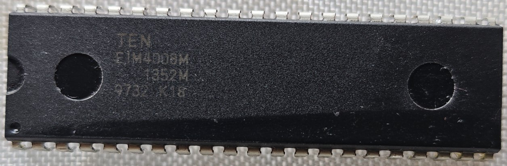

# Disassembler for the Fujitsu MB88400H/MB88500H 4-bit CPU family

A disassembler for the Fujitsu MB88400H/MB88500H (MB88xxx) family of 4-bit microcontrollers, written in Python.

This disassembler targets ROM images for the MB88400H/MB88500H architecture and is intended for reverse engineering, ROM preservation, and firmware analysis.

The MCUs are commonly found in 42-pin DIP (DIP-42) packages.

The MB88400 and MB88500 series are members of Fujitsu's MB88xx family of single-chip 4-bit microcontrollers, introduced in the 1980s for embedded control applications. They integrate a 4-bit CPU core with on-chip ROM and RAM, programmable I/O ports, timers, serial I/O, and interrupt support, making them suitable for consumer electronics, industrial controllers, automotive systems, electronic toys, and handheld devices.

The MB88400 and MB88500 families are upward-compatible successors to the earlier MB8840 and MB8850 microcontrollers. While they retain the same CPU architecture and instruction set, they provide increased on-chip ROM and RAM capacity, expanded I/O capabilities, and enhanced peripheral functions.

The MB88400H (NMOS) and MB88500H (CMOS) are high-speed versions of these enhanced families, maintaining software compatibility with earlier MB88xx devices while offering improved performance.

Contact : trwgQ {leechers not welcome} 26 {remove spaces} xxx {remove spaces} {at} proton {dot} me

# Usage

Usage: python disassemble_mb88xxx.py <input.bin> [output.asm]
* <input.bin> – Input ROM image.
* [output.asm] – Optional output assembly file. If omitted, the disassembly is written to standard output.

# Credits

This project is based on the MB88xx CPU disassembler from MAME, originally written by Ernesto Corvi.

Source: https://github.com/mamedev/mame/tree/master/src/devices/cpu/mb88xx

# License

Shield: [![CC BY-NC-SA 4.0][cc-by-nc-sa-shield]][cc-by-nc-sa]

This work is licensed under a
[Creative Commons Attribution-NonCommercial-ShareAlike 4.0 International License][cc-by-nc-sa].

[![CC BY-NC-SA 4.0][cc-by-nc-sa-image]][cc-by-nc-sa]

[cc-by-nc-sa]: http://creativecommons.org/licenses/by-nc-sa/4.0/
[cc-by-nc-sa-image]: https://licensebuttons.net/l/by-nc-sa/4.0/88x31.png
[cc-by-nc-sa-shield]: https://img.shields.io/badge/License-CC%20BY--NC--SA%204.0-lightgrey.svg
